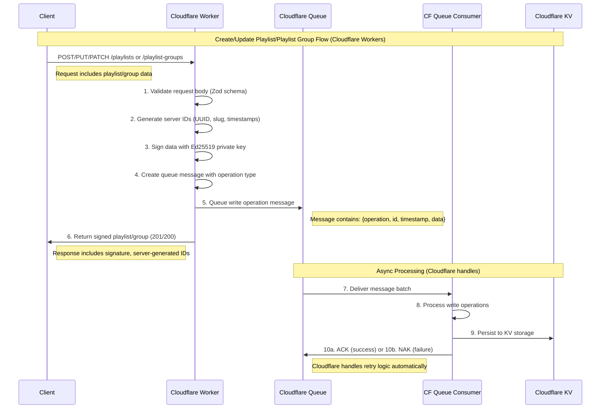
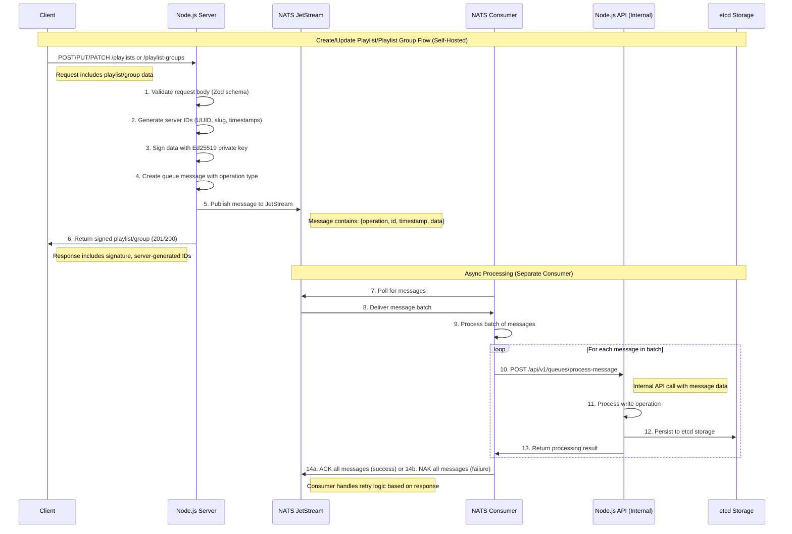
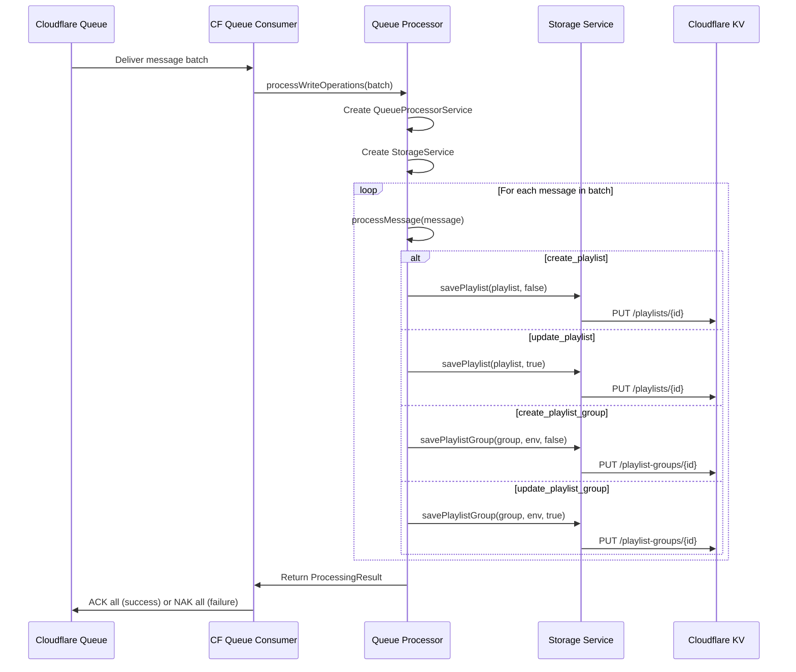
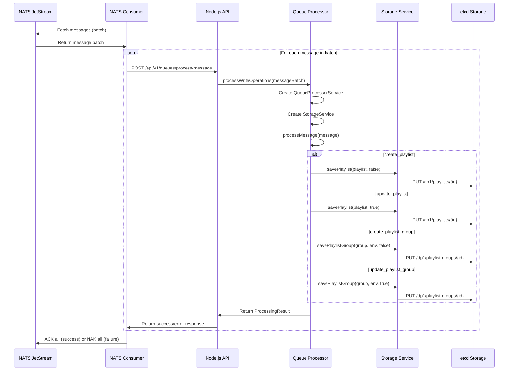
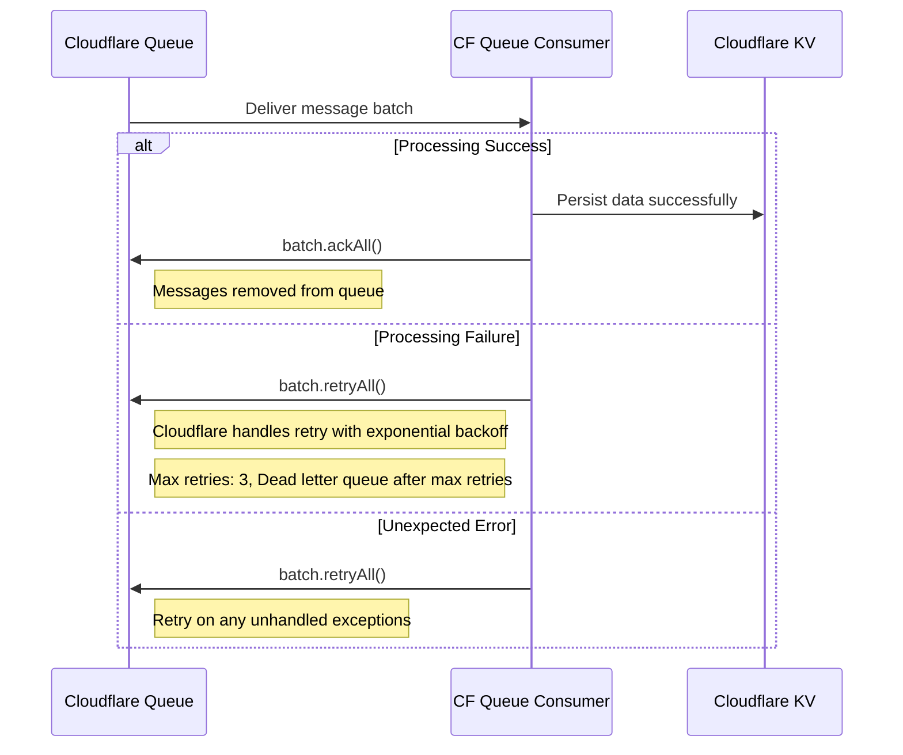
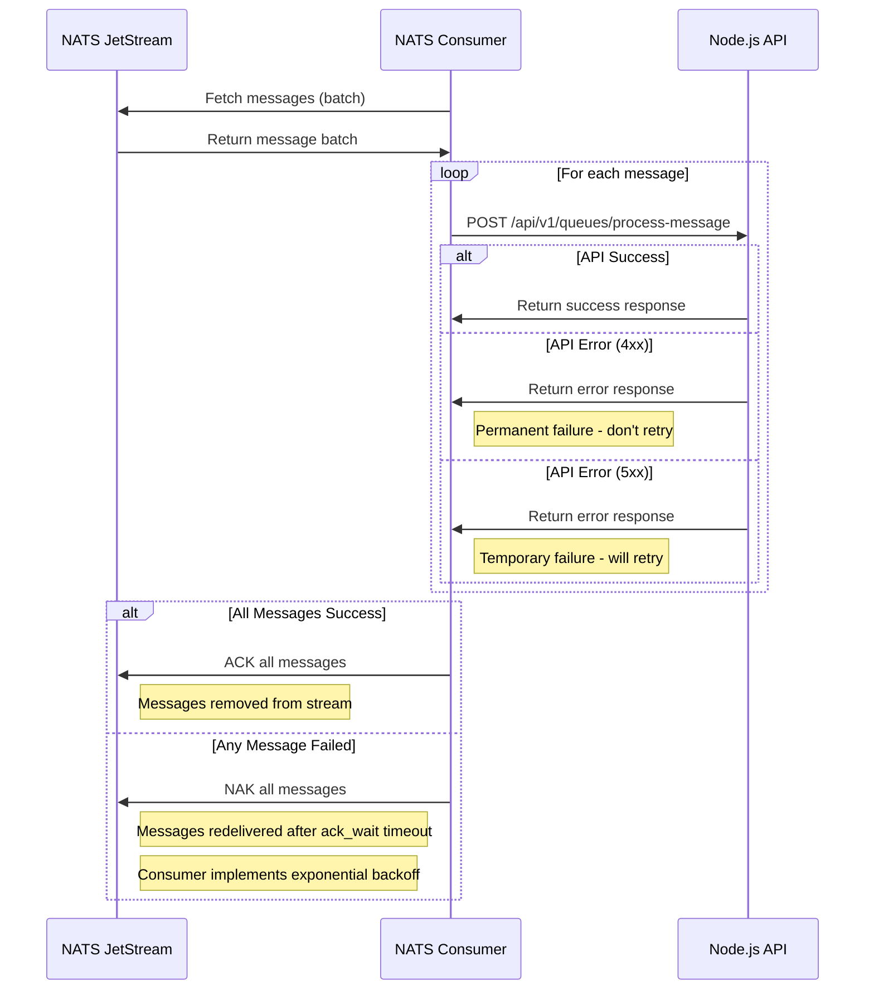

# DP-1 Feed API Flow Sequence Diagrams

This document describes the API flow for both Cloudflare Workers and self-hosted Node.js deployments, covering playlist and playlist group operations.

## Overview

The DP-1 Feed API follows an asynchronous pattern where:

1. API requests are validated and signed immediately
2. Operations are queued for async processing
3. A response is returned to the client before persistence
4. Message consumers process queued operations in the background

## Deployment Types

### 1. Cloudflare Workers Deployment

- **Storage**: Cloudflare KV (key-value store)
- **Queue**: Cloudflare Queue
- **Consumer**: Built-in Cloudflare Queue consumer
- **Processing**: Direct database operations

### 2. Self-Hosted Node.js Deployment

- **Storage**: etcd (key-value store)
- **Queue**: NATS JetStream
- **Consumer**: Separate Node.js consumer service
- **Processing**: HTTP API calls to main server

---

## Sequence Diagram: Playlist/Playlist Group Creation/Update Flow

### Cloudflare Workers Deployment



### Self-Hosted Node.js Deployment



---

## Detailed Message Flow

### Message Structure

Both deployments use the same message structure:

```typescript
interface WriteOperationMessage {
  id: string; // Unique message ID
  timestamp: string; // ISO timestamp
  operation:
    | 'create_playlist'
    | 'update_playlist'
    | 'create_playlist_group'
    | 'update_playlist_group';
  data: {
    playlist?: Playlist; // For playlist operations
    playlistGroup?: PlaylistGroup; // For playlist group operations
    playlistId?: string; // For update operations
  };
  retryCount?: number; // For retry tracking
}
```

### Queue Processing Flow

#### Cloudflare Workers Processing



#### Self-Hosted Processing



---

## Error Handling and Retry Logic

### Cloudflare Workers



### Self-Hosted



---

## Key Differences Between Deployments

| Aspect          | Cloudflare Workers    | Self-Hosted Node.js            |
| --------------- | --------------------- | ------------------------------ |
| **Storage**     | Cloudflare KV         | etcd                           |
| **Queue**       | Cloudflare Queue      | NATS JetStream                 |
| **Consumer**    | Built-in CF consumer  | Separate Node.js service       |
| **Processing**  | Direct database calls | HTTP API calls                 |
| **Retry Logic** | Cloudflare managed    | Custom implementation          |
| **Scaling**     | Automatic             | Manual/container orchestration |
| **Monitoring**  | Cloudflare dashboard  | Custom metrics/logging         |
